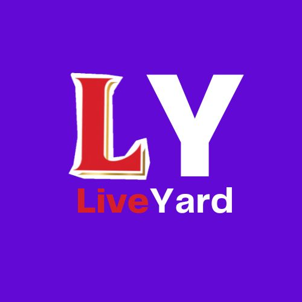

<!--
Hey, thanks for using the awesome-readme-template template.  
If you have any enhancements, then fork this project and create a pull request 
or just open an issue with the label "enhancement".

Don't forget to give this project a star for additional support ;)
Maybe you can mention me or this repo in the acknowledgements too
-->
<div align="center">

  
  <h1>LiveYard</h1>
  
  <p>
    Video Encoder for Youtube Livestreams! 
  </p>
  
  
<!-- Badges -->
<p>
  <a href="https://github.com/RonilPatil22/Live_Yard_Project/graphs/contributors">
    
  </a>
  <a href="">
    
  </a>
  <a href="https://github.com/RonilPatil22/Live_Yard_Project/network/members">
    
  </a>
  <a href="https://github.com/RonilPatil22/Live_Yard_Project/stargazers">
    
  </a>
  <a href="https://github.com/RonilPatil22/Live_Yard_Project/issues/">
    
  </a>
  <a href="https://github.com/RonilPatil22/Live_Yard_Project/blob/master/LICENSE">
    
  </a>
</p>
</div>

<br />

<!-- Table of Contents -->
# :notebook_with_decorative_cover: Table of Contents

- [About the Project](#star2-about-the-project)
  * [Tech Stack](#space_invader-tech-stack)
  * [Features](#dart-features)
  * [Environment Variables](#key-environment-variables)
- [Getting Started](#toolbox-getting-started)
  * [Prerequisites](#bangbang-prerequisites)
  * [Installation](#gear-installation)
  * [Running Tests](#test_tube-running-tests)
  * [Run Locally](#running-run-locally)
  * [Deployment](#triangular_flag_on_post-deployment)
- [Usage](#eyes-usage)
- [Contributing](#wave-contributing)
- [Contact](#handshake-contact)
- [Acknowledgements](#gem-acknowledgements)

  

<!-- About the Project -->
## :star2: About the Project


<!-- Screenshots -->
<!-- ### :camera: Screenshots

<div align="center"> 
  
</div>
-->

<!-- TechStack -->
### :space_invader: Tech Stack

<details>
  <summary>Client</summary>
  <ul>
    <li><a href="https://www.typescriptlang.org/">JavaScript</a></li>
    <li><a href="https://reactjs.org/">React.js</a></li>
    <li><a href="https://tailwindcss.com/">TailwindCSS</a></li>
  </ul>
</details>

<details>
  <summary>Server</summary>
  <ul>
    <li><a href="https://www.typescriptlang.org/">Node.js</a></li>
    <li><a href="https://expressjs.com/">Express.js</a></li>
   <li><a href="https://socket.io/">SocketIO</a></li>
  </ul>
</details>

<details>
<summary>Database</summary>
  <ul>
    <li><a href="https://www.mongodb.com/">MongoDB</a></li>
  </ul>
</details>

<details>
<summary>DevOps</summary>
  <ul>
    <li><a href="https://www.docker.com/">Docker</a></li>
  </ul>
</details>

<!-- Features -->
### :dart: Features

- **FFMPEG-Based RTMP Encoder** : 
Developed a custom encoder using FFMPEG within a Dockerized Ubuntu container to efficiently convert input streams into RTMP format, optimizing for seamless YouTube live streaming.

- **MERN Stack Implementation** :
Built a full-stack web application using the MERN stack (MongoDB, Express.js, React, Node.js), providing a robust platform for managing live stream data and user interaction.

- **Real-Time Data Handling with WebSocket** :
Integrated WebSocket libraries for real-time communication between the client and server, ensuring low-latency data transfer and smooth live streaming.

- **Docker Integration** :
Leveraged Docker to create an isolated, portable container environment, making the setup and deployment process easy and efficient across different systems.

- **Optimized for YouTube** :
The system is specifically optimized for YouTube live streaming, ensuring high performance and reliable stream delivery.

<!-- Env Variables -->
### :key: Environment Variables

To run this project, you will need to add the following environment variables to your .env file

`MONGO_DB_URL`

`NODE_ENV`

`PORT`

`JWT_SECRET`

<!-- Getting Started 
## 	:toolbox: Getting Started

<!-- Prerequisites 
### :bangbang: Prerequisites

This project uses Yarn as package manager

```bash
 npm install --global yarn
```

<!-- Installation
### :gear: Installation

Install my-project with npm

```bash
  yarn install my-project
  cd my-project
```
   
<!-- Running Tests
### :test_tube: Running Tests

To run tests, run the following command

```bash
  yarn test test
```

<!-- Run Locally 
### :running: Run Locally

Clone the project

```bash
  git clone https://github.com/Louis3797/awesome-readme-template.git
```

Go to the project directory

```bash
  cd my-project
```

Install dependencies

```bash
  yarn install
```

Start the server

```bash
  yarn start
```


<!-- Deployment 
### :triangular_flag_on_post: Deployment

To deploy this project run

```bash
  yarn deploy
```

-->
<!-- Usage -->
## :eyes: Usage

Use this space to tell a little more about your project and how it can be used. Show additional screenshots, code samples, demos or link to other resources.


```javascript
import Component from 'my-project'

function App() {
  return <Component />
}
```

<!-- Roadmap
## :compass: Roadmap

* [x] Todo 1
* [ ] Todo 2
-->

<!-- Contributing -->
## :wave: Contributing

<a href="https://github.com/Ronilpatil22/Live_Yard_Project/graphs/contributors">
  
</a>

<!--
Contributions are always welcome!

See `contributing.md` for ways to get started.


<!-- Code of Conduct 
### :scroll: Code of Conduct

Please read the [Code of Conduct](https://github.com/Louis3797/awesome-readme-template/blob/master/CODE_OF_CONDUCT.md)

<!-- FAQ 
## :grey_question: FAQ

- Question 1

  + Answer 1

- Question 2

  + Answer 2


<!-- License 
## :warning: License

Distributed under the no License. See LICENSE.txt for more information.
-->

<!-- Contact -->
## :handshake: Contact

Your Name - [@twitter_handle](https://x.com/ronilpatil22) - ronilpatil22@gmail.com

Project Link: [https://github.com/Ronilpatil22/Live_Yard_Project](https://github.com/Ronilpatil22/Live_Yard_Project)


<!-- Acknowledgments -->
## :gem: Acknowledgements

Use this section to mention useful resources and libraries that you have used in your projects.

 - [Socket.io](https://socket.io/)
 - [Awesome README](https://github.com/matiassingers/awesome-readme)
 - [Emoji Cheat Sheet](https://github.com/ikatyang/emoji-cheat-sheet/blob/master/README.md#travel--places)
 - [Readme Template](https://github.com/othneildrew/Best-README-Template)

